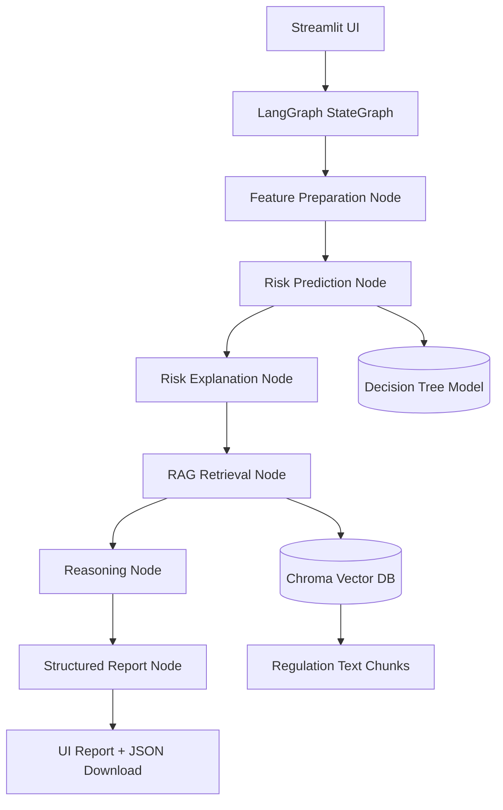

# Agentic AI Lending Decision Support Assistant

This project upgrades a Milestone 1 credit-risk classifier into a Milestone 2 agentic lending assistant using:
- **ML model** for borrower risk prediction
- **LangGraph** for workflow and state orchestration
- **Chroma** for regulation retrieval (RAG)
- **Streamlit** for a local UI
- **Open-source LLM via Hugging Face InferenceClient** for report narration (optional, with fallback)

## Features
- Accept borrower profile and lending query
- Predict default risk and classify borrower
- Explain major risk drivers
- Retrieve regulatory and underwriting references
- Generate a structured lending assessment report
- Download result as JSON

## Input → Output
### Inputs
- Borrower profile fields from the Milestone 1 dataset
- Lending query from the analyst/officer

### Outputs
- Risk probability
- Risk class (Low / Medium / High)
- Recommended action (Approved / Needs Review / Rejected)
- Key risk drivers
- Borrower summary
- Regulatory references
- Disclaimer

## System architecture


## LangGraph workflow
1. `prepare_features`
2. `predict_risk`
3. `explain_risk`
4. `retrieve_guidelines`
5. `reason_over_case`
6. `build_report`

LangGraph is designed for low-level, stateful orchestration using nodes and edges in a `StateGraph`. Nodes can contain LLM calls or ordinary Python functions, and the graph is compiled into a deployable workflow. citeturn733899search0turn733899search3turn733899search18

## RAG notes
This project uses Chroma as a local persistent vector store. Chroma supports a persistent client for local development and collections that store documents plus metadata, with `.add()` for inserts and `query()` for retrieval. citeturn733899search5turn733899search8turn733899search11

## Open-source model notes
The report-generation node uses Hugging Face's `InferenceClient`, which supports chat completion with the Hugging Face Inference API and third-party Inference Providers. If no token is provided, the app falls back to deterministic templated reasoning so the project still runs locally. citeturn122203search0turn122203search1turn122203search5turn122203search7

## UI notes
The app uses Streamlit forms so borrower inputs are submitted in a single batch instead of causing a rerun on every widget change. Streamlit's API supports this pattern through `st.form`, along with widgets like `st.number_input`, `st.text_input`, and `st.selectbox`, and session persistence via `st.session_state`. citeturn713574search2turn713574search5turn713574search8turn713574search9turn713574search10

## Folder structure
```text
lending_agent_project/
├── app.py
├── requirements.txt
├── .env.example
├── README.md
├── artifacts/
├── data/
│   └── regulations/
└── src/
    ├── config.py
    ├── schemas.py
    ├── preprocessing.py
    ├── train_model.py
    ├── explain.py
    ├── rag.py
    ├── llm_client.py
    ├── report.py
    └── graph_flow.py
```

## Setup
```bash
git clone <your-repo-url>
cd lending_agent_project
python -m venv .venv
source .venv/bin/activate   # Windows: .venv\Scripts\activate
pip install -r requirements.txt
cp .env.example .env
```

## Train model artifacts
```bash
python -m src.train_model
```
This creates:
- `artifacts/model_bundle.joblib`
- `artifacts/metrics.json`

## Build the RAG store
```bash
python -m src.rag
```

## Run the app
```bash
streamlit run app.py
```

## Deployment ideas
- Streamlit Community Cloud for the UI
- Hugging Face Spaces for a public demo
- Render/Railway if you want persistent backend hosting

## Bias and hallucination controls
- No sensitive protected attributes are used in the borrower schema
- Output is structured and consistent
- Retrieved regulation excerpts are shown directly in the UI
- Final disclaimer states that the system is decision support, not legal advice
- LLM use is optional; core prediction and retrieval remain deterministic

## Suggested demo flow
1. Show the borrower form
2. Submit a low-risk case
3. Submit a medium/high-risk case
4. Open retrieved guideline excerpts
5. Download the JSON report
6. Show the GitHub repo and project architecture diagram
