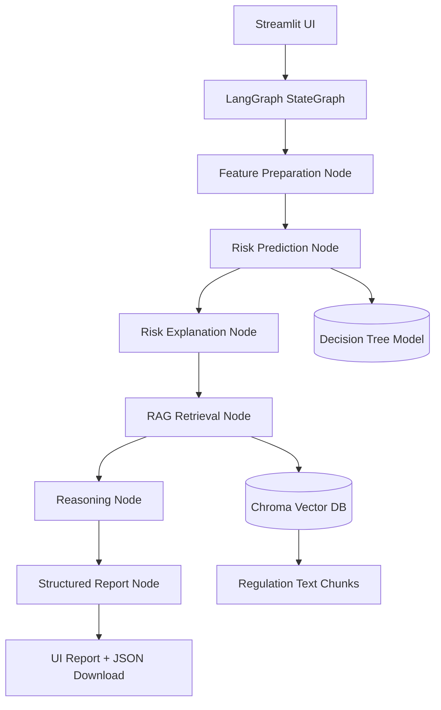

# Agentic AI Lending Decision Support Assistant

This project upgrades a Milestone 1 credit-risk classifier into a Milestone 2 agentic lending assistant using:
- **ML model** for borrower risk prediction
- **LangGraph** for workflow and state orchestration
- **Chroma** for regulation retrieval (RAG)
- **Streamlit** for a local UI
- **Open-source LLM via Hugging Face InferenceClient** for report narration (optional, with fallback)

## Features
- Accept borrower profile and lending query
- Predict default risk and classify borrower
- Explain major risk drivers
- Retrieve regulatory and underwriting references
- Generate a structured lending assessment report
- Download result as JSON

## Input → Output
### Inputs
- Borrower profile fields from the Milestone 1 dataset
- Lending query from the analyst/officer

### Outputs
- Risk probability
- Risk class (Low / Medium / High)
- Recommended action (Approved / Needs Review / Rejected)
- Key risk drivers
- Borrower summary
- Regulatory references
- Disclaimer

## System architecture


## LangGraph workflow
1. `predict` — runs the ML model to get risk probability, class, and key drivers
2. `retrieve` — queries the Chroma vector DB for relevant regulation text
3. `reason` — generates reasoning via Hugging Face LLM (or deterministic fallback)
4. `report` — assembles the final structured report

LangGraph is designed for low-level, stateful orchestration using nodes and edges in a `StateGraph`. Nodes can contain LLM calls or ordinary Python functions, and the graph is compiled into a deployable workflow.

## RAG notes
This project uses Chroma as a local persistent vector store. Chroma supports a persistent client for local development and collections that store documents plus metadata, with `.add()` for inserts and `query()` for retrieval.

## Open-source model notes
The report-generation node uses Hugging Face's `InferenceClient` (from the `huggingface_hub` package) for chat completion with the Hugging Face Inference API. If no `HF_TOKEN` is provided, the app falls back to deterministic templated reasoning so the project still runs locally without any API key.

## UI notes
The app uses Streamlit sidebar widgets for borrower input. It uses `st.number_input`, `st.text_input`, `st.selectbox`, and `st.text_area` for data entry, with a single button to trigger the full assessment pipeline.

## Folder structure
```text
milestone2_capstone/
├── app.py
├── requirements.txt
├── README.md
├── Report.pdf
├── .gitignore
├── artifacts/
│   ├── model_bundle.joblib
│   ├── metrics.json
│   ├── decision_tree_model.pkl
│   ├── feature_columns.pkl
│   └── chroma_db/
└── src/
    ├── __init__.py
    ├── config.py
    ├── schemas.py
    ├── preprocessing.py
    ├── train_model.py
    ├── model_utils.py
    ├── explain.py
    ├── rag.py
    ├── llm_client.py
    ├── reasoning.py
    ├── report.py
    └── graph_flow.py
```

## Setup
```bash
git clone <your-repo-url>
cd milestone2_capstone
python -m venv .venv
source .venv/bin/activate   # Windows: .venv\Scripts\activate
pip install -r requirements.txt
```

Optionally, set a Hugging Face token for LLM-powered reasoning:
```bash
export HF_TOKEN=your_huggingface_token_here
```
If not set, the app will use deterministic fallback reasoning.

## Train model artifacts
```bash
python -m src.train_model
```
This creates:
- `artifacts/model_bundle.joblib`
- `artifacts/metrics.json`

## Build the RAG store
```bash
python -m src.rag
```

## Run the app
```bash
streamlit run app.py
```

## Deployment ideas
- Streamlit Community Cloud for the UI
- Hugging Face Spaces for a public demo
- Render/Railway if you want persistent backend hosting

## Bias and hallucination controls
- No sensitive protected attributes are used in the borrower schema
- Output is structured and consistent
- Retrieved regulation excerpts are shown directly in the UI
- Final disclaimer states that the system is decision support, not legal advice
- LLM use is optional; core prediction and retrieval remain deterministic

## Suggested demo flow
1. Show the borrower form
2. Submit a low-risk case
3. Submit a medium/high-risk case
4. Open retrieved guideline excerpts
5. Download the JSON report
6. Show the GitHub repo and project architecture diagram
